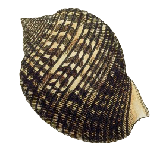

# Cassid: a fake CAS login shell

Cassid is a fake login service for development and testing of CAS clients --
no passwords or pre-registered user-ids are needed.
Rather then struggle with CAS's official Java servlet,
just drop Cassid on any webserver with PHP,
or use the [public Cassid service](https://cassid.habilis.net/).

Cassid can be run via Apache or directly with PHP's build-in web server.
For example, to run on [locahost](http://localhost:8000):

```
git clone https://github.com/chuckhoupt/Cassid.git
cd Cassid
php -S localhost:8000
```

Cassid is named after the [Cassidae](https://en.wikipedia.org/wiki/Cassidae),
sea snails with helmet shaped shell, as well as being a play on "CAS Identity".
